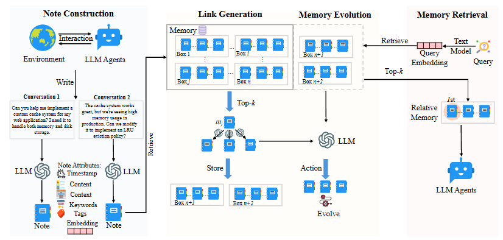

# Memory-arXiv-2025-A-Mem: Agentic Memory for LLM Agents
*论文下载地址：https://arxiv.org/abs/2502.12110*

*代码是否开源：是 https://github.com/WujiangXu/AgenticMemory*

*生产级系统：https://github.com/WujiangXu/A-mem-sys*

*分享人：马明晖*

---

## 一句话总结内容
本文提出A-Mem，一种基于Zettelkasten笔记法的**智能体式记忆系统**，支持LLM智能体自主构建原子笔记、动态关联记忆、自动演化已有知识，无需预设结构即可实现长期、自适应、可检索的记忆管理。

## 一句话总结创新贡献
首次将**自组织知识网络+动态关联+记忆演化**引入LLM智能体记忆，实现无预设结构的自适应记忆管理，在长对话与多跳推理上显著超越MemGPT、MemoryBank等SOTA基线，同时极省Token。

## 举一个例子说明创新点
传统记忆（如MemGPT）只会按时间/相似度存文本，无法关联与更新；
A-Mem会把每段对话存为原子笔记，自动关联相似记忆，新增内容时还会**更新旧记忆的关键词、标签、上下文**，形成会生长、会关联、会进化的知识网络。

## 框架图

**框架工作流描述**
1. 笔记构建（Note Construction）：将交互内容转为结构化原子笔记，生成关键词、标签、上下文描述与向量；
2. 关联生成（Link Generation）：通过向量检索找近邻记忆，由LLM判断是否建立语义关联；
3. 记忆演化（Memory Evolution）：新记忆加入后，自动更新相关旧记忆的描述与标签；
4. 记忆检索（Retrieve）：按查询向量召回相关记忆，并自动带回关联记忆形成上下文。

## 本文挑战及已有工作不足
1. 现有记忆依赖**预设结构与固定流程**，无法自适应任务；
2. 仅做存储与检索，不支持**记忆更新、知识融合、关联推理**；
3. 长对话与多跳推理能力弱，Token开销巨大；
4. 记忆组织僵化，无法像人类一样形成关联知识网络。

## 印象最深刻的点
1. 用**Zettelkasten笔记法**做可生长、可关联、可演化的记忆，高度拟人；
2. 仅用约1200Token/轮，比MemGPT**减少85%–93% Token消耗**；
3. 多跳推理效果翻倍，且百万级记忆仍保持高效检索。

## 对我们的启发
1. 智能体记忆应**自组织而非预设结构**；
2. 记忆不仅是存与取，还应支持**关联、更新、演化**；
3. 轻量级向量检索+LLM决策，可实现高效可扩展的长期记忆；
4. 长对话核心是结构化记忆，而非无限拉长上下文。

## Idea是否好想
Idea**非常直观、高复用、工程友好**：
借鉴成熟笔记法→原子存储→关联检索→动态演化，可直接落地到对话、助手、知识库、客服等场景。

## 是否有开创性
是**LLM智能体记忆领域的开创性工作**：
首次完整实现“自组织+动态关联+记忆演化”三位一体的Agentic Memory，定义新一代记忆架构。

## 是否属于热点
属于**顶会顶级热点**：
LLM Agent、长期记忆、RAG、自组织知识、个性化交互均为核心方向。

## 其他需要补充的点
1. 记忆笔记包含：原文、时间戳、关键词、标签、上下文、关联列表、向量；
2. 支持**跨会话、跨任务、长时间尺度**的知识累积；
3. 在6个基座模型、2个长对话数据集上全面SOTA；
4. 提供t-SNE可视化证明记忆聚类更清晰、结构更合理。

## 与其他论文的关联
1. 对比MemGPT、MemoryBank、LoCoMo、ReadAgent等记忆基线；
2. 融合RAG检索与Zettelkasten知识组织思想；
3. 属于LLM Agent操作系统（AIOS）生态工作。

## 不足与未来工作
1. 当前仅支持文本，未来可扩展**多模态记忆**；
2. 记忆演化策略可进一步学习与优化；
3. 未做个性化遗忘机制，可结合记忆强度设计；
4. 可引入权限、隐私、安全层，支持企业级部署；
5. 可与工具调用、规划模块深度联动。