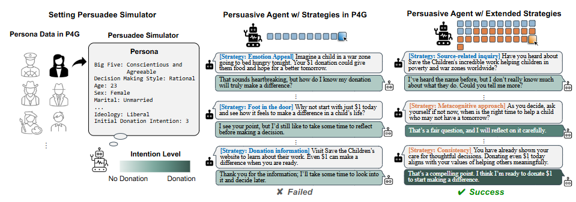

# PD-ACL-2025-Enhancing Persuasive Dialogue Agents by Synthesizing Cross-Disciplinary Communication Strategies
*论文下载地址：https://arxiv.org/abs/2602.22696*

*代码是否开源：未提及*

*分享人：马明晖*

---

## 一句话总结内容
本文整合社会心理学、行为经济学、传播学三大领域的成熟说服理论，将传统 10 种策略扩充为 31 种跨学科策略集合，并基于 ProCoT 提示范式实现动态策略选择，大幅提升对话智能体在多场景下的说服成功率，尤其对初始意愿极低的目标效果显著。

## 一句话总结创新贡献
提出首个跨学科融合的大规模可解释说服策略框架，基于 ELM/HSM 理论构建 31 维策略库，并通过推理式提示实现策略自动选择，在公益说服与通用对话上均显著超越基线。

## 举一个例子说明创新点
普通模型只会反复用“情感打动”“先捐 1 块钱”两种固定话术；
本文模型会先判断对方意愿，对顽固者用“门面技术（先大后小请求）”，对犹豫者用“稀缺性+时间压力”，对怀疑者用“可信度诉诸+社会证明”，策略更丰富、更贴近人类真实说服逻辑。

## 框架图

**框架工作流描述**
1. 跨学科策略提取：从心理学、行为经济学、传播学中整理 31 种说服策略，分为 7 大类；
2. 策略编码与提示构建：将策略加入 ProCoT 提示，让模型先推理上下文、再选策略、最后生成回复；
3. 对话仿真与评估：在 P4G 公益捐赠、DailyPersuasion 通用场景下分别进行自动评估与人工评估；
4. 指标计算：统计说服成功率 SR、平均轮次 AT、意图提升值 AII 等。

## 本文挑战及已有工作不足
1. 现有模型依赖少量固定策略，缺乏跨学科理论支撑；
2. 泛化能力弱，难以适配多领域对话；
3. 对初始意愿极低的人群几乎无法说服；
4. 策略使用单一重复，缺乏动态选择机制。

## 印象最深刻的点
1. 仅通过提示工程 + 扩充策略库，就实现远超基线的效果；
2. 对低初始意图目标的提升幅度最大，直击行业痛点；
3. 构建了可解释、可扩展、可复用的标准化策略体系。

## 对我们的启发
1. 做对话类 AI 要引入对应领域专业理论，不只是堆数据；
2. 多策略动态选择 > 单一固定模板；
3. 推理式提示（ProCoT）能低成本实现复杂策略规划；
4. 必须针对“低意愿用户”做专项优化。

## Idea 是否好想
Idea 直观、可复用、工程友好，从人类真实说服行为抽象而来，容易复现并迁移到销售、谈判、劝导、教育等场景。

## 是否有开创性
是应用层面的开创性工作：首次在对话说服中系统性融合三大学科策略，形成可扩展、可解释的策略框架。

## 是否属于热点
属于顶会热点方向：LLM 对话、说服/谈判智能体、社科理论+AI、提示学习、人机交互。

## 其他需要补充的点
1. 31 种策略分为 7 大类：信息获取、说服路径、信任构建、行动促进、信息呈现、个性化、后续维护；
2. 提出 AII 指标，衡量失败对话中的态度提升；
3. 日英双语实验表明策略有效性受语言文化影响。

## 与其他论文的关联
1. 基于 P4G 数据集与策略体系扩展；
2. 使用 ProCoT 提示框架；
3. 在 DailyPersuasion 上验证泛化能力。

## 不足与未来工作
1. 未研究策略组合与顺序的影响；
2. 未实现领域自适应策略选择；
3. 评估依赖 LLM 模拟器，真实人类实验不足；
4. 未充分考虑文化与语言差异；
5. 伦理与操纵风险有待加强约束。