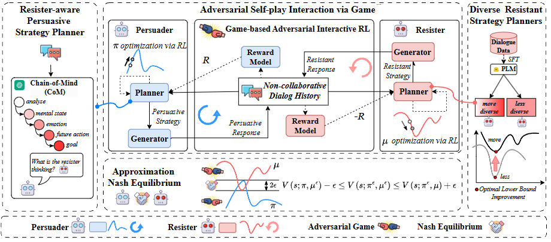

# PD-ACL-2025-GAIA: Simulation-free hierarchical latent policy planning for proactive dialogues
*论文下载地址：https://aclanthology.org/2025.acl-long.261/*

*代码是否开源：未提及*

*分享人：马明晖*

---

## 一句话总结内容
本文提出 GAIA 框架，基于双人零和博弈与 ε‑纳什均衡，通过 Chain-of-Mind 心智推理、多样化抵抗者对抗训练、对抗自博弈强化学习，显著提升非合作对话中对顽固对手的策略规划与说服效果。

## 一句话总结创新贡献
首次将零和博弈、对抗自博弈强化学习、纳什均衡近似引入非合作对话策略规划，提出 CoM 对手心智推理与多样化抵抗者训练，实现对高难度抵抗者的高效说服。

## 举一个例子说明创新点
普通议价模型面对强硬卖家只会机械还价；
GAIA 会先推理对方情绪、真实底线、下一步可能行动，再通过和多种风格的强硬抵抗者对抗学习最优策略，最终逼近纳什均衡，用更少轮次拿到更有利价格，对顽固对手效果远超传统方法。

## 框架图

**框架工作流描述**
1. 对手感知策略规划：使用 Chain-of-Mind (CoM) 推理抵抗者的情绪、未来行动、对话目标；
2. 多样化抵抗者构建：生成不同强度的抵抗策略器，从理论上提升说服者的最优下界；
3. 对抗自博弈交互：构建双人零和马尔可夫博弈，说服者与抵抗者交替选择策略并生成对话；
4. 目标导向奖励计算：根据任务目标给出奖励，使用 REINFORCE 算法优化策略；
5. ε‑纳什均衡迭代验证：迭代优化并验证收敛条件，获取近最优的对话策略。

## 本文挑战及已有工作不足
1. 现有方法多为被动响应，缺乏显式的长期策略规划；
2. 对抗训练中抵抗者能力固定，无法随说服者同步增强；
3. 缺少对对手心智状态的建模，策略缺乏针对性；
4. 面对高对抗、高顽固的“强硬抵抗者”效果明显不足。

## 印象最深刻的点
1. 用严格博弈论建模说服对话，理论严谨且可解释性强；
2. 多样化抵抗者训练显著提升鲁棒性，对最难抵抗者提升幅度最大；
3. 无需环境仿真，纯策略层面优化即可在三个数据集上达到 SOTA。

## 对我们的启发
1. 对抗性对话可以用博弈论 + 强化学习做端到端策略优化；
2. 建模对手心智（ToM/CoM）是说服与辩论的核心能力；
3. 动态对抗自博弈能让模型持续进化，远优于静态数据训练；
4. 近似纳什均衡可作为对话策略“最优性”的可靠指标。

## Idea 是否好想
Idea 理论扎实、工程清晰，将博弈论、心智推理、对抗自博弈自然结合，可复现性强，能直接迁移到议价、辩论、客服、维权等场景。

## 是否有开创性
是**非合作对话策略规划领域的开创性工作**：
首次完整落地“博弈论 + 自博弈 + 纳什均衡”框架，建立可验证、可收敛、可解释的对抗对话范式。

## 是否属于热点
属于当前顶会核心热点：
LLM 策略规划、对抗对话、谈判说服、多智能体自博弈、心智理论（ToM）均为主流方向。

## 其他需要补充的点
1. 提出 Chain-of-Mind (CoM) 显式推理对手心理与下一步行动；
2. 理论证明：多样化抵抗者可严格提升说服者最优下界；
3. 在三个数据集（议价、反仇恨言论、公益说服）均达到 SOTA；
4. 在高对抗、高顽固场景下的收益远高于普通场景。

## 与其他论文的关联
1. 延续非合作对话、策略规划（PPDPP、TRIP）技术路线；
2. 融合心智理论（ToM）与对手建模；
3. 基于零和马尔可夫博弈与多智能体自博弈强化学习。

## 不足与未来工作
1. 强化学习训练计算开销较大，推理速度有待优化；
2. 未在真实人类对话环境中进行大规模验证；
3. 暂不支持多模态、长文本、复杂场景；
4. 可结合领域知识设计更精细的策略与奖励函数；
5. 需加强伦理约束，防范恶意谈判、诱导等滥用风险。