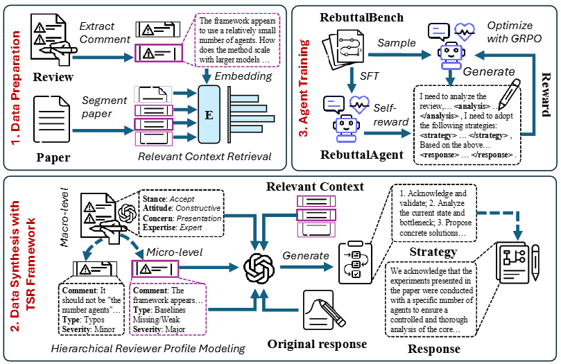

# PD-ICLR-2026-RebuttalAgent: Strategic Persuasion in Academic Rebuttal via Theory of Mind
*论文下载地址：https://arxiv.org/abs/2601.15713*

*代码是否开源：是 https://github.com/Zhitao-He/RebuttalAgent*

*分享人：马明晖*

---

## 一句话总结内容
本文提出 RebuttalAgent，是首个将心理理论（ToM）用于学术审稿回复的大模型智能体，通过 ToM-Strategy-Response（TSR）三阶段框架实现对审稿人的分层心智建模、策略规划与证据型回复生成。

## 一句话总结创新贡献
提出 TSR 分层推理架构 + 自奖励强化学习 + 领域专用评估模型 Rebuttal-RM，把学术回复从表面语言模仿升级为战略说服，在自动指标与人工评估上均超越 GPT-4.1、o3 等模型。

## 举一个例子说明创新点
普通模型面对“缺少消融实验”的意见只会简单回复“我们会补充”；
RebuttalAgent 会先分析审稿人心态（严谨、重视实验可信度），再制定“认同 + 说明补充方案 + 承诺结论可复现”的策略，最后生成逻辑清晰、有理有据的专业回复，更有说服力。

## 框架图

**框架工作流描述**
1. 评论抽取：从原始审稿意见中拆分出独立、可回复的评论点；
2. 上下文检索：从论文中提取与当前评论最相关的文本片段；
3. ToM 分析：宏观（立场、态度、核心关注点、专业度）+ 微观（重要性、方法、实验、表达）分层构建审稿人画像；
4. 策略生成：基于画像输出针对性回复策略；
5. 证据生成：结合策略与原文内容生成专业、有据可依的回复；
6. 训练流程：先 SFT 学习 TSR 范式，再用自奖励 RL 优化，最后用 Rebuttal-RM 做自动化评估。

## 本文挑战及已有工作不足
1. 学术回复是信息不对称下的策略博弈，现有模型只会模仿句式，缺乏战略思考；
2. 缺少带完整推理链的高质量学术回复数据集；
3. 通用大模型做回复评估，与人类专家偏好一致性偏低；
4. 单纯 SFT 容易生成模板化、套话式、低多样性的回复。

## 印象最深刻的点
1. Rebuttal-RM 与人类评分一致性显著超越 GPT-4.1，成为领域专用评估标杆；
2. 仅用 Qwen3-8B 底座，自动评估与人工评估均超过 o3、GPT-4.1 等闭源大模型；
3. 自奖励机制有效解决 reward hacking 和模板化问题。

## 对我们的启发
1. 专业领域说服任务必须先建模对方心智，而不只是生成文本；
2. 分阶段推理（分析→策略→生成）能大幅提升复杂任务效果；
3. 领域专用评估/奖励模型效果远优于通用大模型；
4. 自奖励 RL 可以在无外部标注情况下实现模型持续迭代。

## Idea 是否好想
Idea 直观且工程友好，从学者真实回复流程抽象而来，拆解为分析-策略-生成，结合成熟检索与强化学习，易于复现和迁移。

## 是否有开创性
是领域开创性工作：首次将 ToM 引入学术审稿回复，定义了新任务范式、数据集、训练与评估方案，成为该方向基准。

## 是否属于热点
属于当前顶会热点：LLM+学术智能、心理理论 ToM、战略说服、多阶段推理、Agent 评估均为主流方向。

## 其他需要补充的点
1. 构建 RebuttalBench：70K 高质量带 TSR 推理链的数据；
2. 设计多样性奖励，解决模板化回复；
3. 训练时严格过滤需要新增实验的评论，避免模型伪造证据。

## 与其他论文的关联
1. 延续 ToMAP（ToM+说服对话）思路，迁移到学术专业场景；
2. 基于 Re² Rebuttal 真实审稿回复数据构建；
3. 属于 LLM for Peer Review 系列工作。

## 不足与未来工作
1. 仅支持文本，可扩展公式、图表等多模态回复；
2. 暂不支持需要新增实验的评论回复；
3. ToM 分析依赖提示，可进一步学习化、端到端化；
4. 可结合会议领域、审稿人历史做个性化建模；
5. 伦理与滥用风险的管控可继续加强。