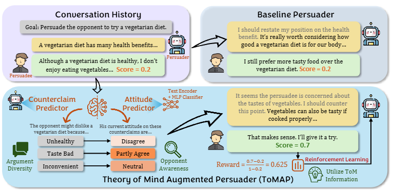

# PD-arXiv-2025-ToMAP: Training Opponent-Aware LLM Persuaders with Theory of Mind
*论文下载地址：https://arxiv.org/abs/2505.22961*

*代码是否开源：是 https://github.com/ulab-uiuc/ToMAP*

*分享人：马明晖*

---

## 一句话总结内容
本文提出 ToMAP 框架，通过心理理论（ToM）双模块与强化学习，让大模型在说服对话中主动建模对手心理状态，生成更有效、更多样、更贴合对手的说服论据。

## 一句话总结创新贡献
首次将反方论点预测 + 对手态度预测双 ToM 模块与 PPO 强化学习结合，仅用 3B 小模型实现超越 GPT-4o 等超大模型的说服效果。

## 举一个例子说明创新点
普通说服模型只会反复强调“应该支持最低工资上调”；
ToMAP 会先预判对手会提出“上调增加小企业成本、导致失业”，再预测对手对这些反论点的认同程度，最后针对性反驳、不重复、更贴合对手想法。

## 框架图

**框架工作流描述**
1. 反方论点预测：根据核心主张，主动生成对手可能提出的 3 个反论点；
2. 对手态度预测：用 BGE-M3 编码器 + MLP 分类器，预测对手对反论点的认同分数；
3. 输入增强：把反论点与态度分数加入说服模型提示；
4. PPO 强化学习：以说服收益、格式、去重等为奖励，训练模型利用 ToM 信息；
5. 多轮对话：持续迭代预测与说服，适配长对话。

## 本文挑战及已有工作不足
1. 现有 LLM 说服模型缺乏心理理论能力，无法动态建模对手想法；
2. 说服过程易重复论据、以自我为中心，不灵活适配对手；
3. 大模型参数量大、成本高，小模型说服能力弱；
4. 直接优化多轮说服难度大，训练不稳定。

## 印象最深刻的点
仅 3B 参数的 ToMAP，在多数据集、多被说服模型上，说服效果相对 GPT-4o 提升 39.4%，证明小模型 + 合理训练可超越超大模型。

## 对我们的启发
1. 说服类任务必须加入对手建模，不能只关注自身论点；
2. 心理理论（ToM）是提升交互类模型的关键方向；
3. 强化学习 + 轻量外部模块，能高效激活策略规划能力；
4. 长对话说服需要动态更新对手状态，而非固定策略。

## Idea 是否好想
Idea 直观且好落地：模拟人类“预判反对→感知态度→针对性回应”的说服逻辑，用两个轻量模块 + 成熟 RL 即可实现。

## 是否有开创性
是开创性工作：首次在 LLM 说服中完整落地双 ToM 模块 + RL 训练，证明小模型可通过对手建模实现超强说服，开辟 ToM+说服新路径。

## 是否属于热点
属于当前热点：LLM 对话交互、智能说服、心理理论（ToM）、多智能体对手建模均为顶会热门方向。

## 其他需要补充的点
1. 采用平衡认同分数解决 LLM 观点不一致问题；
2. 人工评估与模型评估一致性达 0.76，验证实验可靠；
3. ToMAP 更偏好逻辑、共识、预判反驳，少用情感与修辞。

## 与其他论文的关联
1. 承接 LLM 说服能力评估、RL 优化对话生成工作；
2. 融合心理理论（ToM）在多轮对话中的应用；
3. 基于 CMV、Anthropic 等经典说服数据集。

## 不足与未来工作
1. 反论点数量固定为 3，可自适应调整；
2. 态度预测为外部模块，可与说服模型端到端联合训练；
3. 仅支持文本说服，可扩展到多模态；
4. 伦理风险与恶意说服管控可进一步强化。