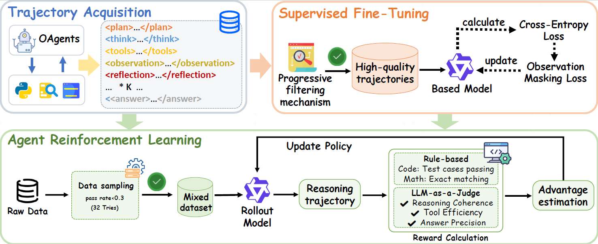

# [arXiv '25] Chain-of-Agents: End-to-End Agent Foundation Models

*论文下载地址：[https://arxiv.org/pdf/2508.13167](https://arxiv.org/pdf/2508.13167)*

*代码是否开源：是 [https://github.com/OPPO-PersonalAI/Agent_Foundation_Models](https://github.com/OPPO-PersonalAI/Agent_Foundation_Models)*

*分享人：周文韬*

## 一句话总结内容
> 提出了一种名为"Chain-of-Agents"(CoA)的新型LLM推理范式，通过多智能体蒸馏和智能体强化学习，在单一模型中实现端到端多智能体协作式复杂问题求解，将传统需要多个专门模型协作完成的任务整合到一个统一的Agent Foundation Model中。

## 一句话总结创新贡献
> 首次提出了将多智能体系统的协作能力通过知识蒸馏技术迁移到单一基础模型中的方法，创造性地构建了包含角色扮演智能体（思考、规划、反思、验证）和工具智能体（搜索、爬虫、代码生成）的统一架构，在Web Agent和Code Agent任务上实现了新的SOTA性能，同时将推理成本降低84.6%。

## 本文挑战及已有工作不足
> **现有工作不足**：
> - 传统多智能体系统依赖人工设计的提示和工作流，计算开销大、泛化能力差、无法通过数据驱动优化
> - 工具集成推理方法仅支持ReAct式单智能体流程，无法模拟多智能体协作
> - 现有LLM未针对多轮、多工具、多角色工作流进行训练

> **本文挑战**：
> - 如何将多智能体系统的协作能力蒸馏至单一模型中
> - 如何设计端到端的训练框架以支持动态角色切换与工具调用
> - 如何在保持高性能的同时大幅降低推理成本

## 印象最深刻的点
> 通过多智能体蒸馏将OAgents等多智能体系统的轨迹转化为CoA格式，再通过监督微调与强化学习训练出支持动态角色调度的Agent Foundation Models，在GAIA、BrowseComp等复杂任务上显著超越现有方法，同时将推理成本降低84.6%。

## 对我们的启发
> - 将多智能体协作能力"内化"至单一模型是提升推理效率与性能的有效路径之一
> - 蒸馏+RL的训练范式可推广至其他需要复杂决策与工具调用的场景
> - 端到端Agent模型在测试时扩展性上表现出色，具备实际部署潜力

## Idea是否好想
> 虽然"蒸馏多智能体系统"的直觉较为直接，但具体实现涉及轨迹重构、质量过滤、RL奖励设计等复杂工程与算法设计，需要深入理解多智能体系统与LLM训练流程。

## 是否有开创性
> 是

## 是否属于Vision
> 是

## 是否属于热点
> 是

## 其他需要补充的点（可选）

## 与其他论文的关联（可选）