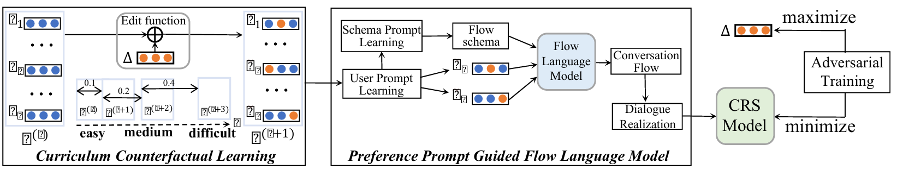

# Recommend-KDD-2023-Improving conversational recommendation systems via counterfactual data simulation
*论文下载地址：https://dl.acm.org/doi/10.1145/3580305.3599387*

*代码是否开源：是 https://github.com/RUCAIBox/CFCRS*

*分享人：马明晖*

## 一句话总结内容
> 提出基于反事实数据仿真的对话推荐增强方法CFCRS，通过反事实用户偏好扩增与多阶段对话模拟器生成高质量对话数据，解决CRS训练数据稀缺问题，通用提升各类模型性能。

## 一句话总结创新贡献
> 首次将反事实数据增强引入对话推荐系统，通过流语言模型保证对话逻辑一致性，结合课程对抗学习生成高价值样本，在数据稀缺场景下显著提升推荐与对话效果。

## 举一个例子说明这篇文章的创新点
> 原始对话：用户喜欢喜剧→推荐《龙虎少年队》→用户喜欢演员Jonah Hill→推荐《超级坏》。
> 传统数据增强：随机替换关键词、改写句子，容易破坏逻辑，生成无效对话。
> CFCRS：
> 1. 反事实编辑：把用户偏好“喜剧”轻微扰动为“家庭喜剧”，实体表示级微调；
> 2. 流语言模型：按照“类型→物品→演员→类型→物品”的固定范式生成新对话流；
> 3. 模板实例化：填充为自然对话，保证逻辑连贯、偏好一致；
> 4. 对抗课程学习：从简单到难逐步加入扰动，生成对训练最有价值的样本。
> 最终生成全新、合理、高价值的训练对话，让模型在数据少时也能学好。

## 框架图

**框架工作流描述**：
1. 异构图表示学习：基于知识图谱构建用户-实体异构图，学习用户与实体表示；
2. 流模式挖掘：从真实对话中抽取高频对话流模式（如类型→物品→演员）；
3. 流语言模型（FLM）：以用户偏好+流模式为提示，生成规范连贯的对话流；
4. 模板实例化：将对话流填充为自然语言对话，保证流畅与保真；
5. 反事实偏好编辑：对用户交互实体做轻量扰动，生成反事实用户；
6. 课程对抗学习：交替优化编辑函数与推荐模型，逐步提升样本难度与价值。

## 本文挑战及已有工作不足
1. 对话推荐数据集**规模小、标注成本极高**，严重数据稀缺；
2. 传统文本数据增强（EDA、Mixup）易破坏对话逻辑，生成低质量样本；
3. 直接随机生成对话**缺乏结构与一致性**，无法用于训练CRS；
4. 数据扩增缺少“难度控制”，简单样本对模型提升有限；
5. 已有方法未从用户偏好反事实角度构建高价值训练样本。

## 印象最深刻的点
1. 用**对话流+模式**保证生成对话的结构性与逻辑性，非常巧妙；
2. 反事实编辑在**实体表示层面**做轻量扰动，不破坏整体语义；
3. 课程学习+对抗训练完美结合，自动生成“最难但最有用”的样本；
4. 模型无关框架，即插即用增强KBRD、BARCOR、UniCRS等所有CRS；
5. 仅用20%数据就能达到全量数据效果，工业落地价值极高。

## 对我们的启发
1. 数据稀缺时，**反事实仿真**比简单文本增强更有效、更可靠；
2. 结构化对话流（Schema）是生成高质量对话的关键；
3. 对抗训练能自动挖掘“高价值样本”，大幅提升学习效率；
4. 课程学习让扩增从易到难，训练更稳定、收敛更快；
5. 模型无关的数据增强框架，具备极高的复用与落地价值。

## Idea是否好想
Idea非常清晰且工程化：**数据稀缺→反事实扩增→结构化生成→对抗课程学习**，逻辑闭环、模块解耦、可复现性强，是解决CRS数据问题的最优路径之一。

## 是否有开创性
是**开创性工作**：首次将反事实数据仿真引入对话推荐，建立“用户偏好反事实+结构化对话生成”的全新数据增强范式。

## 是否属于热点
属于**顶级热点**：对话推荐、数据增强、反事实学习、低资源训练、知识增强对话均是KDD、SIGIR、WWW、ACL顶会核心方向。

## 其他需要补充的点（可选）
> 数据集：ReDial、INSPIRED（电影领域）
> 核心模块：流语言模型FLM、反事实编辑、课程对抗学习、模板实例化
>  Backbone：KBRD、BARCOR、UniCRS
> 评估指标：Recall@k、MRR、NDCG、Distinct-n、流畅度、信息度

## 与其他论文的关联（可选）
> 优于EDA、Mixup等传统文本扩增方法；
> 基于知识图谱增强CRS（KBRD、UniCRS），解决其数据不足问题；
> 拓展反事实数据增强到对话系统，填补领域空白。

## 还有哪些不足的地方（未来工作）
> 对话实例化仅用模板，未使用大模型生成更自然的自由对话；
> 仅在电影领域验证，未扩展到电商、音乐等场景；
> 未支持多轮动态反事实干预与用户长期偏好演化；
> 流语言模型预训练依赖伪数据，生成多样性可进一步提升；
> 未结合LLM做端到端仿真，流程可进一步简化统一。