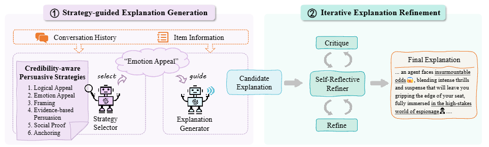

# Recommend-EMNLP-2024-Beyond Persuasion: Towards Conversational Recommender System with Credible Explanations
*论文下载地址：https://aclanthology.org/2024.emnlp-main.4264/*

*代码是否开源：是 https://github.com/mumen798/PC-CRS*

*分享人：马明晖*

## 一句话总结内容
> 提出可信说服对话推荐模型PC-CRS，通过可信度感知的说服策略生成与迭代自反思修正，解决大模型推荐中“为了说服而编造事实”的问题，同时保证说服力与事实正确性。

## 一句话总结创新贡献
> 首次在对话推荐中明确解决**说服与可信的平衡问题**，提出双阶段框架（策略引导生成+自反思修正），在不降低说服力的前提下大幅提升解释的事实可信度，并间接提升推荐准确率。

## 举一个例子说明这篇文章的创新点
> 用户喜欢喜剧片，系统推荐《碟中谍》。
> 传统LLM-CRS为了说服用户，会编造“这是一部爆笑喜剧”，虽然说服性高，但完全错误，破坏用户信任。
> PC-CRS做法：
> 1. 策略生成阶段：选择逻辑诉诸、证据支持等可信策略，基于真实信息生成解释；
> 2. 自反思阶段：检查解释是否与电影真实信息一致，修正错误描述；
> 最终输出：“《碟中谍》是经典动作冒险片，剧情紧凑刺激，非常值得观看”，既真实可信，又保持说服力。
> 核心创新：**只基于事实说服，不编造信息**，兼顾说服效果与长期用户信任。

## 框架图

**框架工作流描述**：
1. 策略引导解释生成：基于对话历史与物品真实信息，从6种可信说服策略中选择合适策略，生成候选解释；
2. 迭代自反思修正： Critic模块检查候选解释是否存在事实错误，Refiner模块迭代修正错误信息，直到完全可信；
3. 输出最终解释：保证推荐解释**同时具备说服力与事实一致性**；
4. 可信对话上下文：干净可靠的上下文进一步提升推荐模块的偏好理解精度。

## 本文挑战及已有工作不足
1. 现有LLM对话推荐**只追求说服**，常编造虚假信息误导用户，损害长期信任；
2. 说服与可信存在天然冲突，提升可信度易降低说服效果；
3. 大模型天生倾向“顺应用户”而非“忠于事实”，易产生幻觉；
4. 已有方法无显式可信校验，无法识别与修正错误解释；
5. 缺乏同时衡量说服力与可信度的统一评估体系。

## 印象最深刻的点
1. 精准指出大模型推荐的致命问题：**为说服而造假**；
2. 双阶段设计简洁高效：策略保说服，反思保可信，无需训练；
3. 6种可信说服策略源自社会科学理论，可解释、可迁移；
4. 提升可信度同时**反而提升推荐成功率**，形成正向循环；
5. 人工评估与模型评估一致性高，结论可靠。

## 对我们的启发
1. 下一代可信AI必须平衡**效果与事实正确性**，不能牺牲真实性；
2. 自反思（Self-Reflection）是修正大模型幻觉的简单高效手段；
3. 推荐解释不仅要“像人话”，更要“忠于事实”；
4. 可信的对话上下文能显著提升推荐精度；
5. 社会科学理论（说服理论）能为NLP模型提供坚实设计依据。

## Idea是否好想
Idea非常直观且工程友好：**先按可信策略生成→再自查纠错**，直击大模型幻觉痛点，是可信对话推荐最自然的解决方案，易复现、易落地。

## 是否有开创性
是**开创性工作**：首次在对话推荐领域正式定义并解决“说服vs可信”的核心矛盾，建立可信说服推荐新范式，为可信对话AI奠定基础。

## 是否属于热点
属于**顶级热点**：可信大模型、对话推荐、可解释推荐、事实一致性、幻觉修正均是EMNLP、ACL、NeurIPS顶会核心方向。

## 其他需要补充的点（可选）
> 数据集：Redial、OpendialKG
> 核心策略：逻辑诉诸、情感诉诸、框架效应、证据支持、社会证明、锚定效应
> 评估指标：说服力(Persuasiveness)、可信度(Credibility)、可信接受率(Convincing Acceptance)、推荐成功率(SR)
> 实现方式：训练-free，纯提示工程+双阶段反思

## 与其他论文的关联（可选）
> 对比InterCRS、ChatCRS、MACRS等，解决其幻觉造假问题；
> 不同于传统说服对话，本文强调“可信说服”；
> 基于精细化路径说服模型(ELM)社会科学理论设计策略。

## 还有哪些不足的地方（未来工作）
> 每轮仅选择单一策略，多策略组合与动态切换能力不足；
> 策略选择未个性化适配不同用户性格；
> 仅验证电影领域，未扩展到电商、旅游等场景；
> 反思迭代次数固定，缺乏自适应停止机制；
> 开源模型上的鲁棒性与效果仍有提升空间。