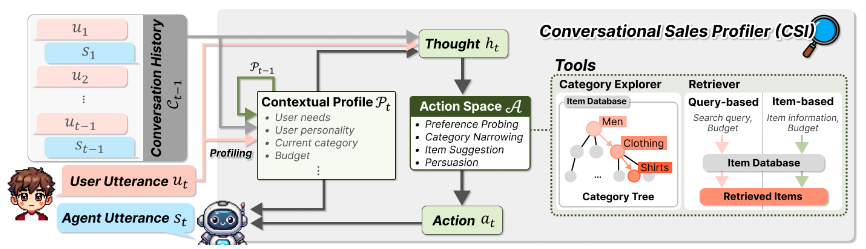

# Recommenf-EMNLP-2025-Towards Personalized Conversational Sales Agents
*论文下载地址：https://arxiv.org/abs/2504.08754*

*代码是否开源：否*

*分享人：马明晖*

## 一句话总结内容
> 提出面向电商真实场景的对话销售任务CSALES，构建基于真实行为数据的细粒度用户模拟器CSUSER，并设计上下文用户画像的智能销售代理CSI，实现偏好挖掘、推荐与个性化说服一体化。

## 一句话总结创新贡献
> 首次将对话推荐扩展为真实电商的**对话销售任务**，构建基于真实评论数据的用户模拟器，并提出动态用户画像驱动的智能销售代理，大幅提升推荐成功率与说服转化率。

## 举一个例子说明这篇文章的创新点
> 用户想买保暖休闲冬装，预算30元左右，偏向理性决策、被动型用户。
> 传统对话推荐：只问属性、推荐预算内商品，无法打动用户下单。
> 本文方法：
> 1. 先通过CSUSER识别用户画像：理性、被动、看重材质与性价比；
> 2. CSI先主动探询偏好，缩小品类范围，推荐预算内基础款；
> 3. 观察用户犹豫后，启动**个性化说服**，用逻辑对比+证据说明高价款更耐用；
> 4. 最终说服用户接受超预算商品，完成真实销售转化。
> 核心差异：传统只做匹配，本文做**销售引导+个性化说服**。

## 框架图

**框架工作流描述**：
1. **用户画像构建**：从亚马逊真实评论数据，抽取长期偏好、当前需求、预算、性格（开放度/决策风格）、购买动机；
2. **用户模拟CSUSER**：基于细粒度画像生成类人回复与购买决策，支持可扩展、高真实度的自动评估；
3. **上下文画像更新CSI**：每轮对话动态更新用户画像，保留关键信息、过滤冗余；
4. **统一动作空间**：支持偏好探查、品类收缩、商品推荐、个性化说服；
5. **工具增强**：分类导航+向量检索，保证推荐 grounded、可解释；
6. **说服策略选择**：根据用户决策风格（理性/依赖/直觉）选择框架、逻辑、情感、证据、社会证明。

## 本文挑战及已有工作不足
1. 传统对话推荐只做**偏好匹配**，无法完成真实电商的**销售转化**；
2. 现有用户模拟器基于虚构人设，无法模拟真实消费决策复杂性；
3. 缺少统一评估范式，无法衡量“说服用户超预算购买”的销售能力；
4. 已有代理被动响应，不会根据用户性格**动态调整销售策略**；
5. 推荐与说服割裂，无法形成一体化的对话销售流程。

## 印象最深刻的点
1. 将推荐任务升级为**销售任务**，贴近真实电商闭环，极具工业价值；
2. 用户画像极度精细：偏好、需求、性格、决策风格、预算、购买动机；
3. 首创**SWR（销售胜率）** 指标，衡量说服超预算购买的能力；
4. 代理会根据用户性格**切换沟通与说服策略**，高度拟人化；
5. 模拟器与人类判断一致性超90%，可替代人工评估。

## 对我们的启发
1. 下一代对话推荐系统必须走向**可转化、可说服、可盈利**的销售范式；
2. 细粒度用户画像（性格+决策方式）是个性化交互的核心；
3. 评估体系必须包含**转化指标**，而非仅看推荐准确率；
4. 主动式对话+策略化说服，是提升商业价值的关键；
5. 基于真实行为的用户模拟器，是低成本迭代对话系统的必备基础设施。

## Idea是否好想
Idea非常贴近真实场景、直观好想：**对话推荐→对话销售 + 精细用户模拟 + 策略化说服**，是学术界走向工业落地的自然延伸，结构清晰、可复现、可落地。

## 是否有开创性
是**开创性工作**：首次定义对话销售任务CSALES，建立真实用户模拟评估体系CSUSER，并提出完整的个性化销售代理框架，开创对话推荐商业化新方向。

## 是否属于热点
属于**顶级热点**：大模型对话推荐、个性化电商交互、用户模拟、说服式对话、目标导向对话均是EMNLP、ACL、WWW、KDD核心方向。

## 其他需要补充的点（可选）
> 领域：服装、电子两大电商领域
> 数据：Amazon Reviews 2023
> 核心指标：SR（推荐成功率）、SWR（销售胜率/超预算说服率）
> 说服策略：框架、逻辑诉诸、情感诉诸、证据、社会证明
> 用户性格：对话开放度（主动/中性/被动）、决策风格（理性/依赖/直觉）

## 与其他论文的关联（可选）
> 扩展传统CRS（ChatCRS、MACRS）为销售导向对话；
> 对比PC-CRS等单纯说服模型，本文兼顾推荐与转化；
> 优于iEvaLM、PEPPER、CONCEPT等模拟器，基于真实用户行为。

## 还有哪些不足的地方（未来工作）
> 仅支持服装、电子领域，需扩展到更多电商品类；
> 长期对话策略规划能力不足，多轮长期博弈待优化；
> 未结合多模态（图片、视频）进行更生动的商品说服；
> 未建模用户情绪变化与实时满意度波动；
> 开源模型上的效果与鲁棒性有待进一步验证。