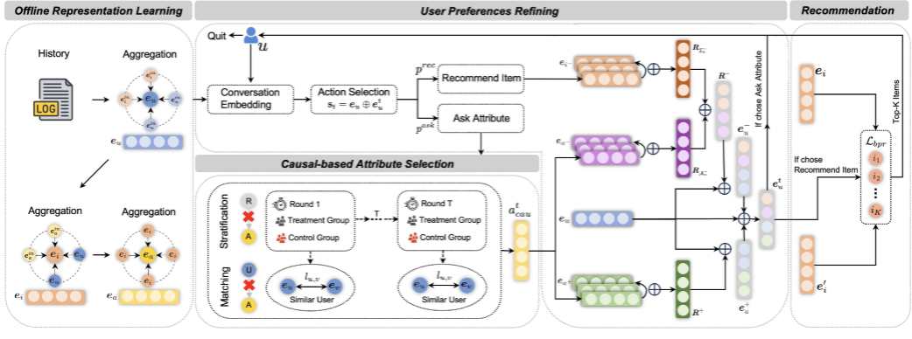

# Recommend-TKDE-2025-A Causal-Based Attribute Selection Strategy for Conversational Recommender Systems
*论文下载地址：https://ieeexplore.ieee.org/abstract/document/10891447*

*代码是否开源：否*

*分享人：马明晖*

## 一句话总结内容
> 提出基于因果推断的对话推荐模型CCR，通过分层与匹配消除时间与用户属性的混淆偏差，利用ATE量化因果效应，实现更精准的属性选择与个性化推荐。

## 一句话总结创新贡献
> 首次在对话推荐中引入因果推断消除时间与用户属性混淆偏差，设计基于ATE的因果属性选择机制，显著提升推荐成功率与对话效率。

## 举一个例子说明这篇文章的创新点
> 用户一开始喜欢户外用品，晴天接受遮阳帽，后来下雨拒绝遮阳帽、接受雨衣。
> 传统对话推荐：会误以为遮阳帽和雨衣相关，学到虚假关联，问错属性、推荐不准。
> CCR：用分层消除时间（轮次）混淆，用匹配消除用户属性混淆，计算每个属性的ATE因果效应，优先问因果驱动最强的属性，避开天气、职业等干扰因素，精准抓住用户真实偏好，快速推荐成功。

## 框架图

**框架工作流描述**：
1. 离线表示学习：从历史数据学习用户、物品、属性的长期偏好表示；
2. 因果属性选择：用分层消除时间混淆，用匹配消除用户属性混淆，计算ATE选出每轮最优因果属性；
3. 用户偏好精炼：结合在线正负反馈，注意力聚合更新用户表示，融合长短期偏好；
4. 推荐决策：基于精炼用户表示，用BPR损失做Top-K推荐；
5. 策略决策：DQN决定每轮是问属性还是直接推荐。

## 本文挑战及已有工作不足
1. 对话推荐中**时间混淆**：用户偏好随轮次变化，导致模型学到伪相关；
2. **用户属性混淆**：职业、年龄等差异让相似用户表现不同，干扰偏好学习；
3. 现有方法只学相关性，不学因果性，无法识别用户行为真实驱动因素；
4. 属性选择策略依赖统计信息，易受偏差影响，个性化与鲁棒性不足；
5. 多轮对话中无法有效去偏，推荐成功率低、对话轮次多。

## 印象最深刻的点
1. 首次用因果图清晰刻画对话推荐中的时间与用户属性混淆问题；
2. 分层+匹配双去偏，完美阻断后门路径，实现无偏ATE估计；
3. 用ATE量化属性因果效应，取代传统熵/相似度，属性选择更科学；
4. 因果推断与对话推荐深度结合，理论扎实、提升显著、可解释强；
5. 消融实验证明：去偏与因果选择是性能提升核心。

## 对我们的启发
1. 对话推荐不能只建模相关性，**建模因果性**才能更鲁棒、可解释；
2. 混淆偏差（时间、用户、流行度）是推荐系统通病，因果推断是通用解决方案；
3. 属性/问句选择可从**因果效应**角度优化，而非仅信息增益；
4. 离线表示+在线精炼+因果去偏，是下一代对话推荐的通用架构；
5. 因果方法能显著提升冷启动、小众偏好用户的个性化效果。

## Idea是否好想
Idea非常直观且工程友好：**识别混淆→因果去偏→量化效应→选择最优**，是因果推断在对话推荐中最自然的落地路径，逻辑清晰、易复现、易扩展。

## 是否有开创性
是**开创性工作**：首次将因果推断用于对话推荐的属性选择与混淆去偏，建立完整的因果对话推荐范式，为CRS提供全新研究方向。

## 是否属于热点
属于**顶级热点**：对话推荐系统、因果推断、推荐去偏、交互式推荐均是TKDE、SIGIR、KDD、WWW顶刊顶会核心方向。

## 其他需要补充的点（可选）
> 数据集：Yelp、Douban-Book、MovieLens、Baby Goods
> 核心模块：离线表示、因果属性选择、偏好精炼、DQN策略、BPR推荐
> 关键指标：SR@5/10/20（成功率）、AT（平均轮数）
> 核心创新：分层去时间偏、匹配去用户偏、ATE因果属性选择

## 与其他论文的关联（可选）
> 对比EAR、FPAN、UNICORN、SCPR、CRM等传统CRS，全面领先；
> 区别于CECR反事实解释，本文聚焦属性选择与混淆去偏；
> 继承因果推断在推荐系统的去偏思路，首次迁移到多轮对话场景。

## 还有哪些不足的地方（未来工作）
> 仅考虑属性层面因果，未深入物品级、用户意图级因果挖掘；
> 因果估计依赖历史数据，在线自适应更新能力不足；
> 未建模多意图、动态偏好更复杂的因果关系；
> 仅在英文/商品数据集验证，中文与多领域泛化待测试；
> 因果计算复杂度可进一步优化，提升实时性。